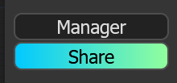
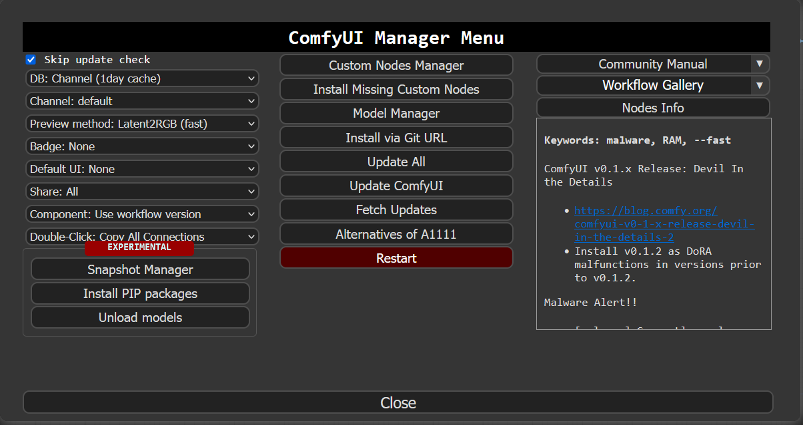
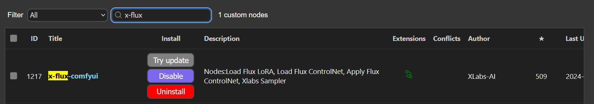
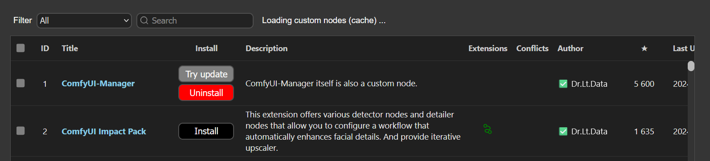
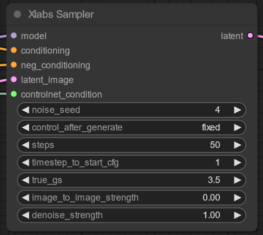
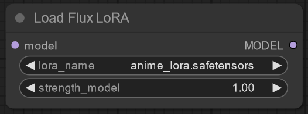
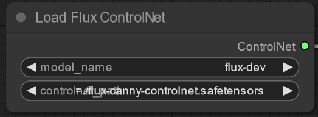
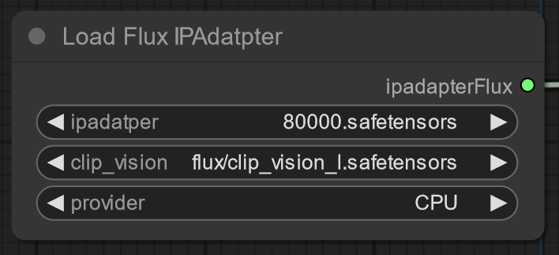
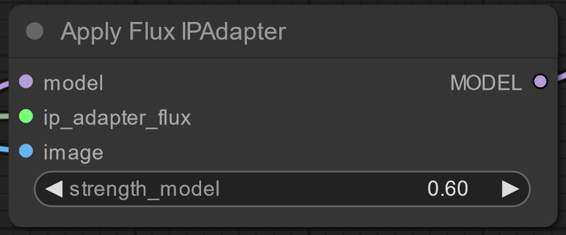
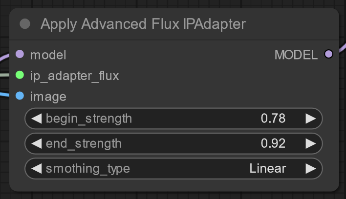

# Guide

# Installing

First of all, you should install ComfyUI and [ComfyUI Manager](https://github.com/ltdrdata/ComfyUI-Manager).

After that, launch ComfUI.

In the right panel you can find “Manager” button, click on.

You will see big window, click on “Custom Nodes Manager”. 

Go to search field, and start typing “x-flux-comfyui”,

Click “install” button.

Now, you have access to X-Labs nodes, you can find it in “XLabsNodes” category.

# Flux Installing

There is complete guide by Comfyanonimus [Guide](https://comfyanonymous.github.io/ComfyUI_examples/flux/)

Important! You should use flux dev, not schnell, if your computer is capable of this, it is better to use fp8 or bf16 (default).

# Nodes

## XLabs Sampler:

Node inputs:

model: get FLUX diffusion model (from unet loader)

conditioning & neg_conditioning: input prompts after T5 and clip models (clip only allowed, but you should know, that you will not utilize about 40% of flux power, so use dual text node)

latent_image: latent input for flux, may be empty latent or encoded with FLUX AE (VAE Encode) image (for image-to-image using)

controlnet_condition: input for XLabs-AI ControlNet conditioning

Output:

latent: FLUX latent image, should be decoded with VAE Decoder to get image

Parameters: 

noise_seed, control_after_generate: controls random generator

steps: how many denoise steps will diffusion go

timestep_to_start_cfg: how many steps diffusion will do before start to use negative sampling and cfg

true_gs: true cfg scale, will be used after first “**timestep_to_start_cfg” steps**

image_to_image_strength: how much will the original image affect to the output

denoise_strength: how many noise will remain

## Load Flux LoRA

Gets flux model on input and outputs model modified with XLabs LoRA (strength of LoRA and name are selected by the parameters)

## Load Flux ControlNet

Gets controlnet name and returns flux controlnet.

## Apply Flux ControlNet

Gets controlnet, image and strength as parameter. Returns controlnet condition for XLabs Sampler.

## Load Flux IPAdapter

Gets IP Adapter name, CLIP ViT model and on which device it will work. Choose CUDA only if you have enough VRAM. Return Flux IPAdapter.

## Apply Flux IPAdapter

Gets FLUX model, IP Adapter and image. Returns modified model. Strength of IP Adapter comes from parameter.

## Apply Advanced IPAdatper

Like common one, but has more strength parameters.

# Models

We use custom folder for LoRAs, ControlNets and IPAdapters, the folders contains in `models\xlabs`.

LoRAs goes to `ComfyUI\xlabs\loras`.

ControlNets goes to `ComfyUI\xlabs\controlnets`.

IPAdapters goes to `ComfyUI\xlabs\ipadapters`.

An IPAdapter requires a CLIP VIT. We currently use Open-AI Clip ViT Large. You can find it here.

[CLIP ViT model](https://huggingface.co/openai/clip-vit-large-patch14).

Download model.safetensors, rename it as you want to (but .safetensors is required). And put it to `ComfyUI\models\clip-vision\`.
