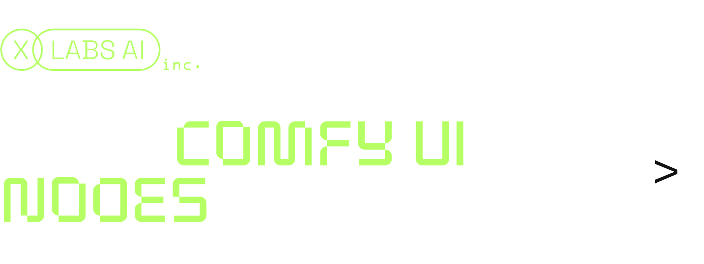
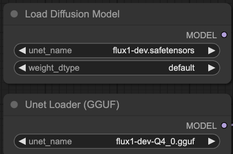

# *[Guide](/Guide.md)*

# How to use



## Installation:

1. Go to `ComfyUI/custom_nodes`
2. Clone this repo, path should be `ComfyUI/custom_nodes/x-flux-comfyui/*`, where * is all the files in this repo
3. Go to  `ComfyUI/custom_nodes/x-flux-comfyui/` and run `python setup.py`
4. Run ComfyUI after installing and enjoy!

After the first launch, the `ComfyUI/models/xlabs/loras` and `ComfyUI/models/xlabs/controlnets` folders will be created automatically. <br/>
So, to use lora or controlnet just put models in these folders. <br/>
After that, you may need to click "Refresh" in the user-friendly interface to use the models. <br/>
For controlnet you need install https://github.com/Fannovel16/comfyui_controlnet_aux <br/>
## Low memory mode
You can launch Flux utilizing 12GB VRAM memory usage.
1. Follow installation as described in repo https://github.com/city96/ComfyUI-GGUF
2. Use flux1-dev-Q4_0.gguf from repo https://github.com/city96/ComfyUI-GGUF <br/>
3. Launch ComfyUI with parameters:
```bash
python3 main.py --lowvram --preview-method auto --use-split-cross-attention
```
In our workflows, replace "Load Diffusion Model" node with "Unet Loader (GGUF)"



## Models

We trained **Canny ControlNet**, **Depth ControlNet**, **HED ControlNet** and **LoRA** checkpoints for [`FLUX.1 [dev]`](https://github.com/black-forest-labs/flux) <br/>
You can download them on HuggingFace:

- [flux-controlnet-collections](https://huggingface.co/XLabs-AI/flux-controlnet-collections)
- [flux-controlnet-canny](https://huggingface.co/XLabs-AI/flux-controlnet-canny)
- [flux-RealismLora](https://huggingface.co/XLabs-AI/flux-RealismLora)
- [flux-lora-collections](https://huggingface.co/XLabs-AI/flux-lora-collection)
- [flux-furry-lora](https://huggingface.co/XLabs-AI/flux-furry-lora)
- [flux-ip-adapter](https://huggingface.co/XLabs-AI/flux-ip-adapter/)
## IP Adapter

### Instruction
1. Update x-flux-comfy with `git pull` or reinstall it.
2. Download Clip-L `model.safetensors` from [OpenAI VIT CLIP large](https://huggingface.co/openai/clip-vit-large-patch14), and put it to `ComfyUI/models/clip_vision/*`.
3. Download our IPAdapter from [huggingface](https://huggingface.co/XLabs-AI/flux-ip-adapter/tree/main), and put it to `ComfyUI/models/xlabs/ipadapters/*`.
4. Use `Flux Load IPAdapter` and `Apply Flux IPAdapter` nodes, choose right CLIP model and enjoy your genereations.
5. You can find example workflow in folder workflows in this repo.

### Limitations
The IP Adapter is currently in beta.
We do not guarantee that you will get a good result right away, it may take more attempts to get a result. But we will make efforts to make this process easier and more efficient over time.
